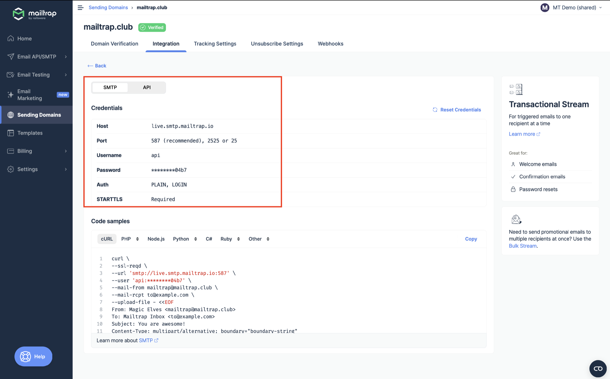
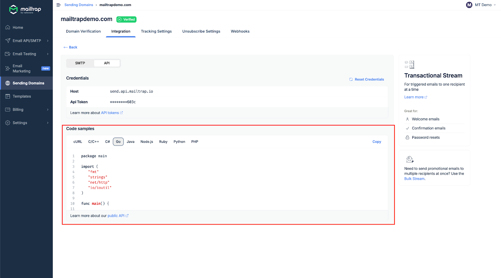

# Overview

<i class="fa-code">:code:</i>

Mailtrap can be integrated with Go apps and projects for email sending.

# Email API/SMTP for Go

## SMTP integration

To integrate SMTP with your Go app, navigate to the **Integrations** tab and copy-paste the credentials.


SMTP integration is compatible with any Go framework or library that sends emails via SMTP.


Read more about SMTP integration [here](../../documentation/sending/smtp-sending/smtp-integration.md).

## RESTful API integration

To integrate Mailtrap using RESTful API, use the configuration available among **Code samples** under the API section.

API integration can be used with any Go framework or library that supports HTTP requests. For more details, refer to the [API documentation](https://api-docs.mailtrap.io/docs/mailtrap-api-docs/5tjdeg9545058-mailtrap-api).

Read more about API integration [here](../../documentation/sending/api-sending/api-integration.md).
