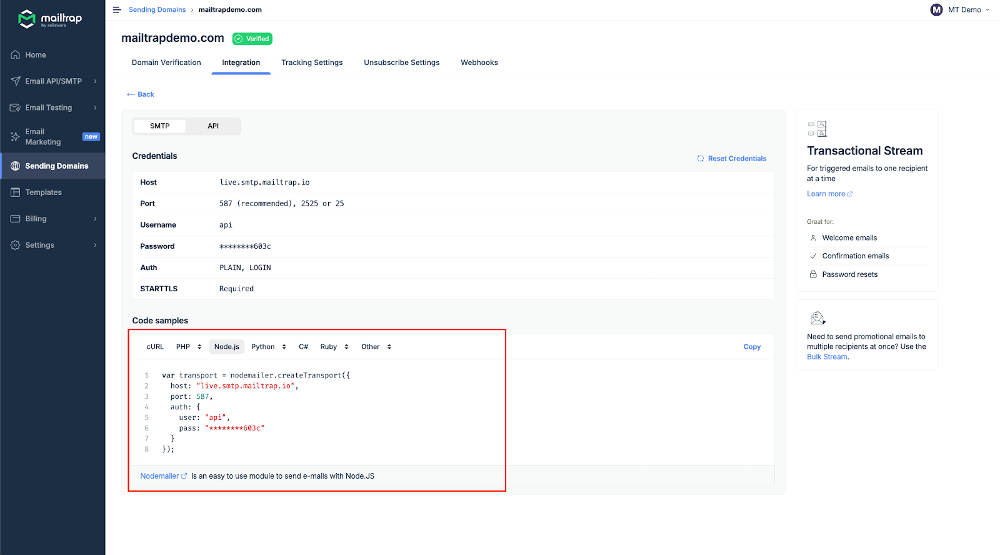
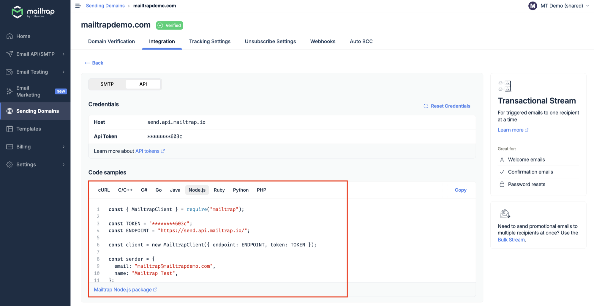

# Node.js Integration

<a href="https://github.com/mailtrap/mailtrap-nodejs" class="button primary">Mailtrap Node.js SDK on GitHub</a>

## Node.js Integration

### Overview

Mailtrap can be integrated with Node.js apps for email sending purposes with SDK, SMTP, and RESTful API.

### Email API/SMTP for Node.js

#### SDK integration

The [Mailtrap Node.js SDK](https://github.com/mailtrap/mailtrap-nodejs) provides a simple and intuitive way to send transactional and bulk emails from your Node.js applications. The SDK supports:

* Transactional email sending
* [Nodemailer](https://github.com/mailtrap/mailtrap-nodejs?tab=readme-ov-file#nodemailer-transport)
* Batch email sending
* Template management
* Contact management
* Sandbox testing
* Account management

### Installation

Install the SDK using npm or yarn:


```bash
npm install mailtrap
```



```bash
yarn add mailtrap
```


### Minimal Example

Here's a minimal example to send your first email:


```javascript
const { MailtrapClient } = require("mailtrap");

const client = new MailtrapClient({ token: "your-api-token" });

const sender = { name: "Mailtrap Test", email: "hello@example.com" };

client.send({
  from: sender,
  to: [{ email: "recipient@example.com" }],
  subject: "Hello from Mailtrap!",
  text: "Welcome to Mailtrap Email Sending!",
})
.then(console.log)
.catch(console.error);
```



Get your API token from the Mailtrap dashboard under **Settings → API Tokens**.


#### SMTP integration

To integrate SMTP with your Node.js app, navigate to the **Integration** tab under Sending Domains and copy/paste the ready-made code snippet or credentials.


You'll have to use Nodemailer, as Node.js doesn't have built-in support for SMTP sending.


<div align="left" data-with-frame="true"></div>

Read more about SMTP integration in the [Email API/SMTP - SMTP Integration](https://app.gitbook.com/s/S3xyr7ba7aGO19rc8dSK/email-api-smtp/smtp-integration) article.

#### RESTful API integration

To integrate Mailtrap using RESTful API, use the sample configuration among **Code samples** under the API section.

API integration can be used with any Node.js framework or library that supports HTTP requests. For more details, refer to the [API documentation](https://api-docs.mailtrap.io/docs/mailtrap-api-docs/5tjdeg9545058-mailtrap-api).

<div data-with-frame="true"></div>

Read more about API integration in the [Email API/SMTP - API Integration](https://app.gitbook.com/s/S3xyr7ba7aGO19rc8dSK/email-api-smtp/api-integration) article.
