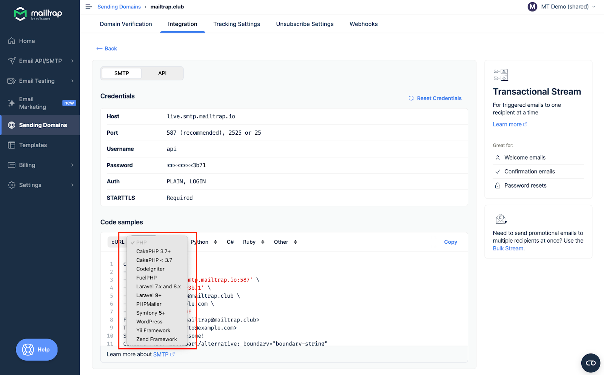
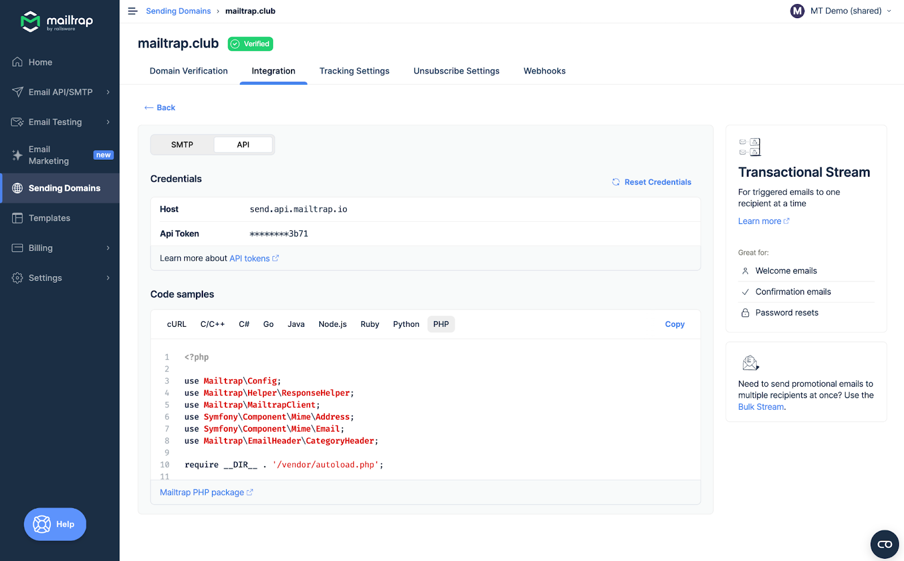

# Overview

Mailtrap can be integrated with PHP apps and projects for email sending.

# Email API/SMTP for PHP

## SDK integration

You can integrate Mailtrap into your PHP project or app using the [official SDK](https://github.com/railsware/mailtrap-php). The SDK offers access to both Transactional and Bulk Streams, Email Templates, and Account Management and provides dedicated bridges for Laravel and Symfony.

Additionally, you can watch the [course released by Symfony Casts](https://symfonycasts.com/screencast/mailtrap) for a step-by-step integration walkthrough.

## SMTP integration

To integrate SMTP with your PHP app, navigate to the **Integrations** tab, choose the desired PHP framework, and copy-paste the credentials or ready-made code snippets.


SMTP integration is compatible with any PHP framework or library that sends emails via SMTP.


Read more about SMTP integration [here](../../documentation/sending/smtp-sending/smtp-integration.md).

## RESTful API integration

To integrate Mailtrap using RESTful API, use the configuration available among **Code samples** under the API section.

API integration can be used with any PHP framework or library that supports HTTP requests. For more details, refer to the [API documentation](https://api-docs.mailtrap.io/docs/mailtrap-api-docs/5tjdeg9545058-mailtrap-api).

Read more about API integration [here](../../documentation/sending/api-sending/api-integration.md).
