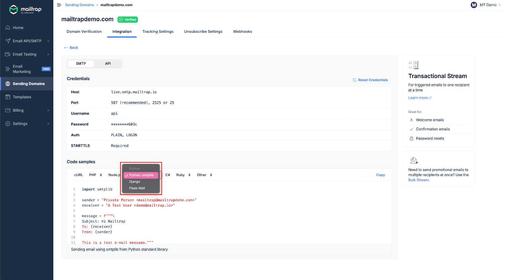
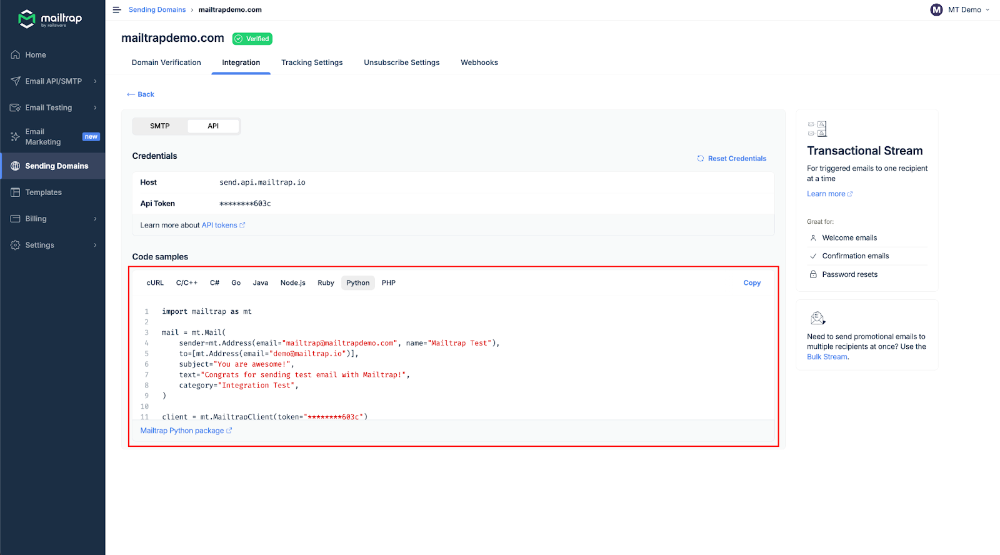

# Python Integration

## Overview

Mailtrap can be integrated with Python apps and projects for email sending purposes.

## Email API/SMTP for Python

### SDK Integration

You can integrate Mailtrap into your Python project or app using the [official SDK](https://github.com/railsware/mailtrap-python). The SDK offers access to both Transactional and Bulk Streams, and Email Templates.

### SMTP Integration

To integrate SMTP with your Python app, navigate to the **Integrations** tab, choose the desired Python framework, and copy-paste the credentials or ready-made code snippets.


SMTP integration is compatible with any Python framework or library that sends emails using SMTP.


Read more about SMTP integration in the [Email API/SMTP - SMTP Integration](../../documentation/sending/smtp-sending/smtp-integration.md) article.

### RESTful API Integration

To integrate Mailtrap using RESTful API, use the configuration available among **Code samples** under the API section.

API integration can be used with any Python framework or library that supports HTTP requests. For more details, refer to the [API documentation](https://api-docs.mailtrap.io/docs/mailtrap-api-docs/5tjdeg9545058-mailtrap-api).

Read more about API integration in the [Email API/SMTP - API Integration](../../documentation/sending/api-sending/api-integration.md) article.
