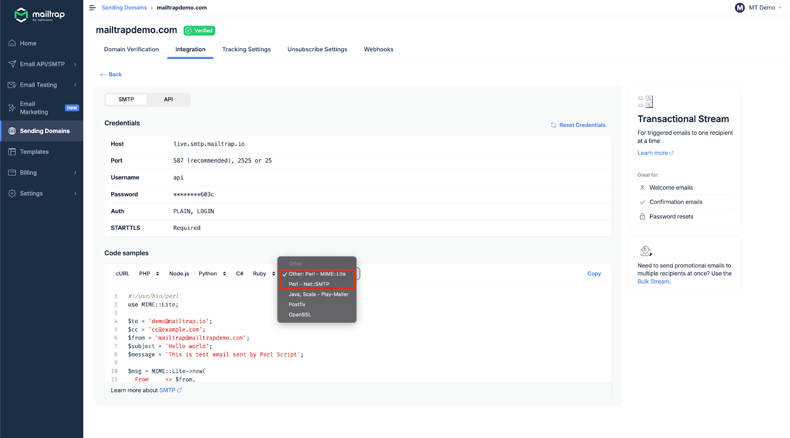
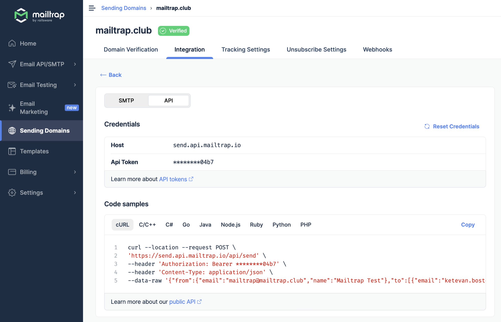

# Perl Integration

## Overview

Mailtrap can be integrated with Perl apps and projects for email sending.

## Email API/SMTP for Perl

### SMTP Integration

To integrate SMTP with your Perl app, navigate to the **Integrations** tab, choose the desired Perl framework, and copy-paste the credentials or ready-made code snippets.


SMTP integration is compatible with any Perl framework or library that sends emails via SMTP.


Read more about SMTP integration [here](https://app.gitbook.com/s/S3xyr7ba7aGO19rc8dSK/email-api-smtp/setup/smtp-integration).

### RESTful API Integration

To integrate Mailtrap using RESTful API, simply copy/paste the API endpoint and API Token into the configuration file of a Perl framework or library that supports HTTP requests.

For more details, refer to the [API documentation](https://api-docs.mailtrap.io/docs/mailtrap-api-docs/5tjdeg9545058-mailtrap-api).

Read more about API integration in the [here](https://app.gitbook.com/s/S3xyr7ba7aGO19rc8dSK/email-api-smtp/setup/api-integration).
