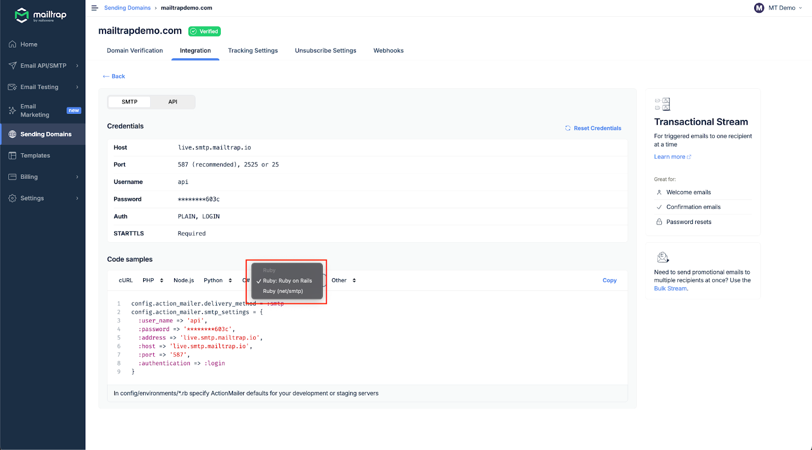
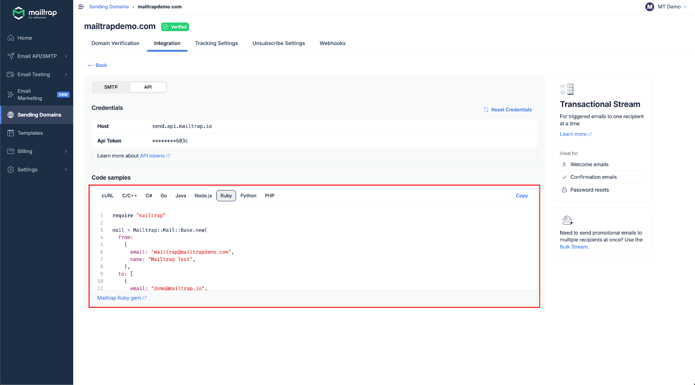

# Ruby

<a href="https://github.com/mailtrap/mailtrap-ruby" class="button primary">Mailtrap Ruby SDK on GitHub</a>

### Overview

Mailtrap can be integrated with Ruby apps and projects for email sending.

### Email API/SMTP for Ruby

#### SDK integration

The [Mailtrap Ruby SDK](https://github.com/mailtrap/mailtrap-ruby) provides an idiomatic Ruby interface for sending transactional and bulk emails. The SDK supports:

* Transactional email sending
* Batch email sending
* Template management
* [ActionMailer](https://github.com/mailtrap/mailtrap-ruby/blob/main/examples/action_mailer.rb) integration for Rails applications
* Comprehensive error handling

### Installation

Add the SDK to your Gemfile:


```ruby
gem 'mailtrap'
```


Then run:


```bash
bundle install
```


### Minimal Example

Here's a minimal example to send your first email:


```ruby
require 'mailtrap'

client = Mailtrap::Client.new(api_key: 'your-api-token')

mail = Mailtrap::Mail::FromTemplate.new(
  from: { email: 'hello@example.com', name: 'Mailtrap Test' },
  to: [{ email: 'recipient@example.com' }],
  template_uuid: 'template-uuid',
  template_variables: {
    'user_name' => 'John Doe'
  }
)

# Or send a simple email
mail = {
  from: { email: 'hello@example.com', name: 'Mailtrap Test' },
  to: [{ email: 'recipient@example.com' }],
  subject: 'Hello from Mailtrap!',
  text: 'Welcome to Mailtrap Email Sending!',
  html: '<p>Welcome to <strong>Mailtrap</strong> Email Sending!</p>'
}

response = client.send(mail)
puts response
```



Get your API token from your Mailtrap account under **Settings → API Tokens**.


#### SMTP integration

To integrate SMTP with your Ruby app, navigate to the **Integrations** tab, choose either Ruby on Rails or Ruby Net/SMTP, and copy-paste the credentials or ready-made code snippets.


SMTP integration is compatible with any Ruby framework or library that sends emails via SMTP.


<div data-with-frame="true"></div>

Read more about SMTP integration in the [Email API/SMTP - SMTP Integration](https://app.gitbook.com/s/S3xyr7ba7aGO19rc8dSK/email-api-smtp/setup/smtp-integration) article.

#### RESTful API integration

To integrate Mailtrap using RESTful API, use the configuration available among **Code samples** under the API section.

API integration can be used with any Ruby framework or library that supports HTTP requests. For more details, refer to the [API documentation](https://api-docs.mailtrap.io/docs/mailtrap-api-docs/5tjdeg9545058-mailtrap-api).

<div data-with-frame="true"></div>

Read more about API integration in the [Email API/SMTP - API Integration](https://app.gitbook.com/s/S3xyr7ba7aGO19rc8dSK/email-api-smtp/setup/api-integration) article.
