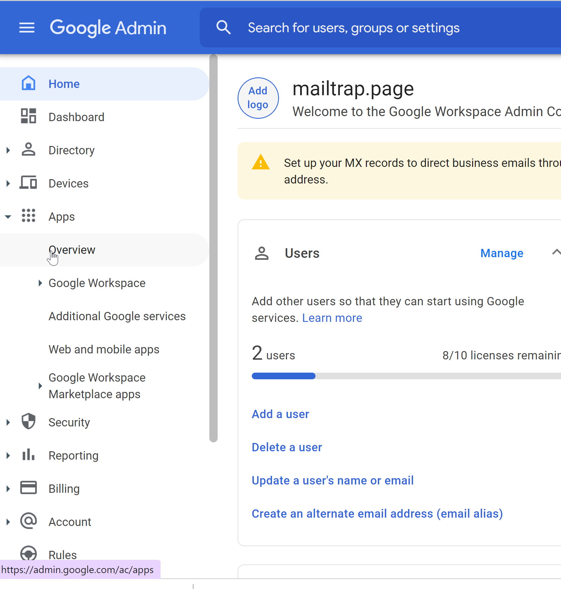
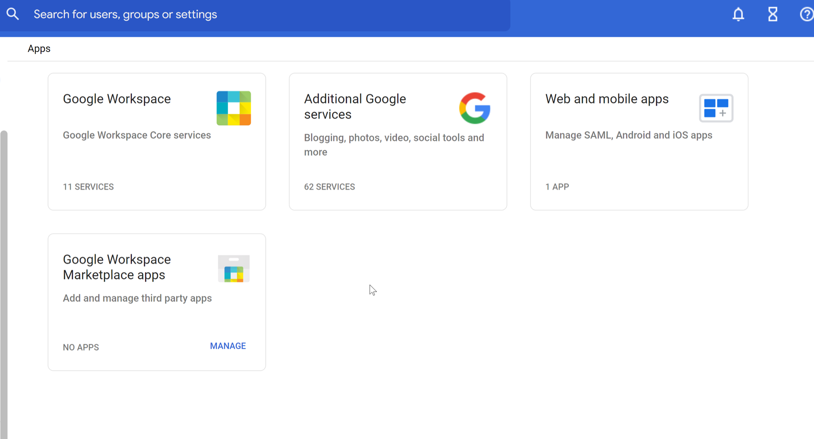
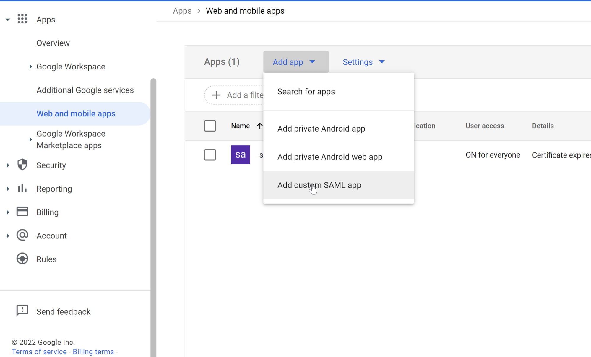
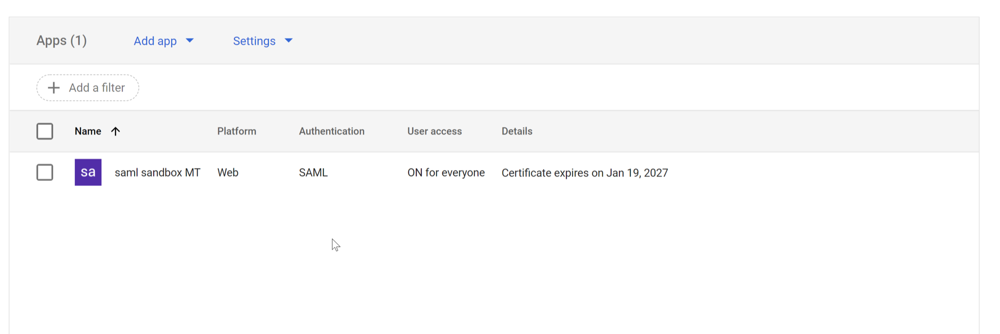
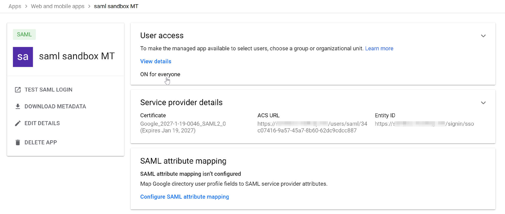
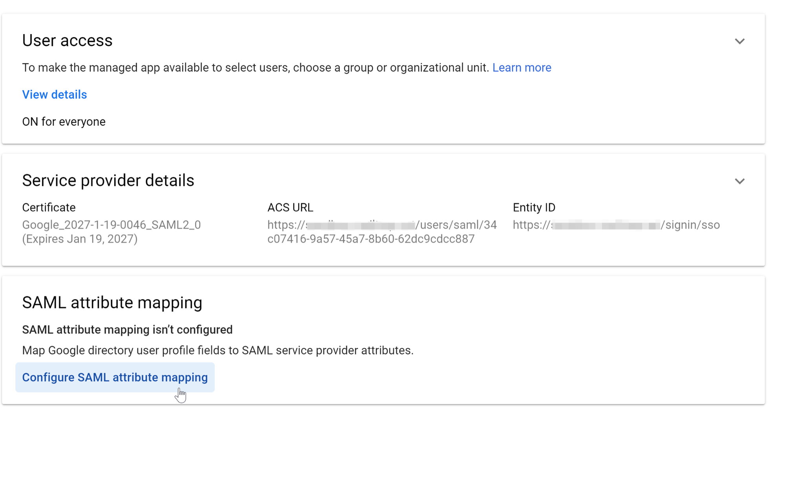
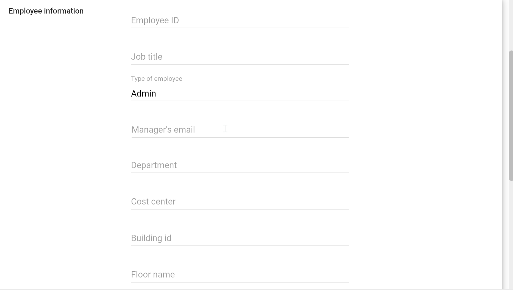

# Setup SSO with Google Workspace

## Overview

This guide walks you through configuring SAML-based Single Sign-On (SSO) between Google Workspace and Mailtrap.

## On Google Admin side

### Access the Apps section



Go to **Apps** in the **Google Admin console**




Navigate to **Web and mobile apps**




### Create a custom SAML app



Navigate to the **Web and mobile apps** section in Google Admin.



Click the **Add app** dropdown button to see available app options.



Select **Add custom SAML app** from the dropdown menu.




### Copy Google identity provider details

Google will provide you with the following SAML configuration details. Copy these values to use in Mailtrap:

* **SSO URL**
* **Entity ID**
* **Certificate**

### Configure service provider details

Provide the following SAML Provider details to Google from Mailtrap:

* **ACS URL** → Assertion Consumer Service URL from Mailtrap
* **Entity ID** → Entity ID from Mailtrap

### Verify the application

After configuration, your SAML app will appear in the Web and mobile apps list:

### Review the configuration

You can review the service provider details and configure attribute mapping:

### Enable the application

Turn on the SAML app for your users:



Go to the **Service Status** section for your SAML app.



Select **ON for everyone** to enable the app for all users, or choose specific organizational units if you want to limit access.



Click **Save** to apply the changes and enable the application.




## Permissions

By default, we create users with no permissions. If you want the user to be automatically assigned to Account Admin or Account Viewer role, you need to set up the role mapping.

### Configure role mapping

In the following example, we assign the roles depending on the **Type** of employee attribute value.

#### Configure attribute mapping in Google



Click **SAML attribute mapping**.




Map the **Google Directory attribute** to the **App attribute**

* **Google Directory attributes**: Employee Details > Type
* **App attributes**: Type




Save your attribute mapping configuration.



#### Set employee type in Google Directory

In the **Google Directory** user profile, set the **Type of employee** field (e.g., "Admin", "Viewer"):

#### Configure role mapping in Mailtrap

In Mailtrap SSO settings, map the **Type** attribute to the appropriate Mailtrap roles (Admin, Viewer)

Your Google Workspace SSO configuration with role mapping is now complete.
