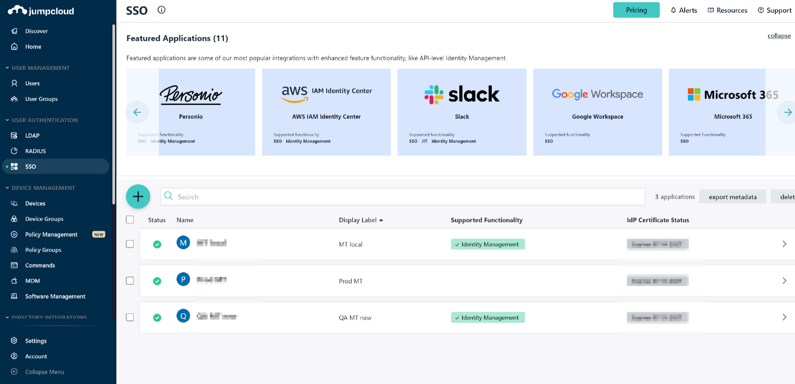
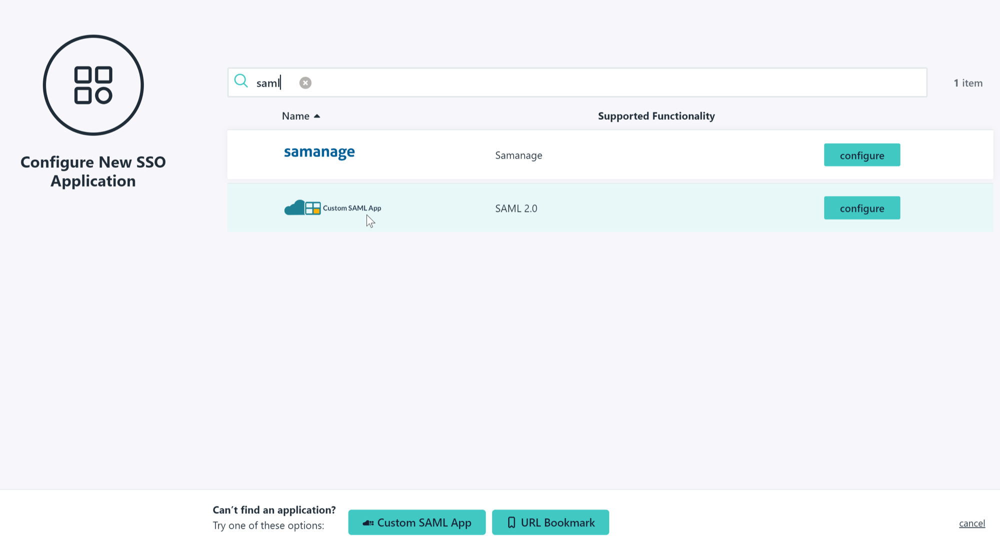
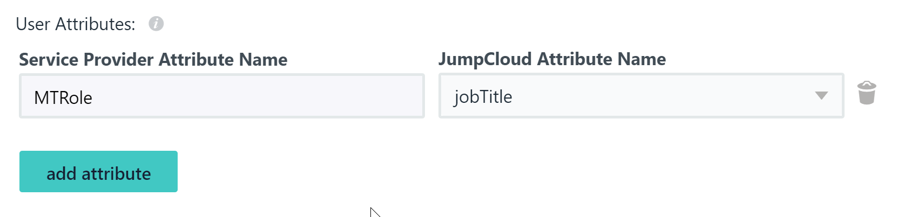
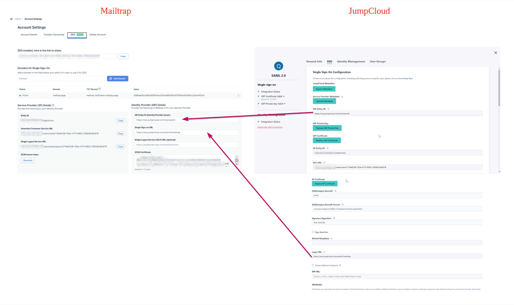

# Setup SSO with JumpCloud

## Overview

This guide walks you through configuring SAML-based Single Sign-On (SSO) between JumpCloud and Mailtrap.

## On JumpCloud side



Navigate to **SSO** in JumpCloud and click the **+** button to add new application.




Search for **SAML** and choose **Custom SAML App**.




Specify the application name and proceed to the **SSO** tab.




Provide the following SAML Provider details to JumpCloud from Mailtrap:

* **SP Entity ID** → Entity ID from Mailtrap
* **ACS URL** → Assertion Consumer Service URL from Mailtrap

Additional SAML settings:

* **SAMLSubject NameID** should be `email`
* **SAMLSubject NameID Format** leave default value
* **Signature Algorithm** leave default value



If you want to use role mapping, specify **User Attributes** for role mapping:




Click **Activate**, then click **Save** after successful activation. Then, download the certificate from the **IDP Certificate Valid** section.




## On Mailtrap side

After configuration is ready on JumpCloud side, you can set up the configuration on Mailtrap side.



Provide the following to Mailtrap from JumpCloud:

* **IdP Entity ID** (Identity Provider Issuer) → IdP Entity ID from JumpCloud
* **Single Sign-on URL** → IDP URL from JumpCloud
* **X509 Certificate** → Value from the downloaded certificate




Click **Save** in Mailtrap SSO configuration. For role mapping, configure additional settings as described in the [SSO Guide](sso-guide.md#step-5-role-mapping).

Your SAML configuration is now complete.


