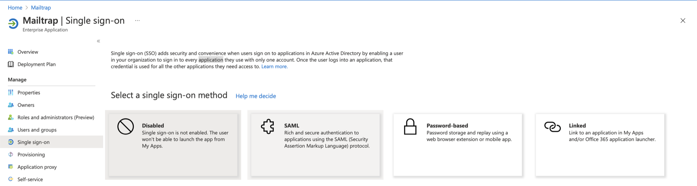
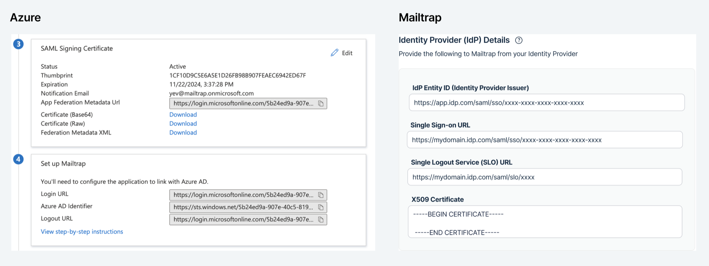
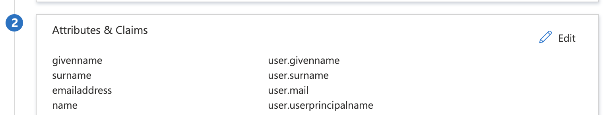

# Overview

This guide walks you through configuring SAML-based Single Sign-On (SSO) between Azure Active Directory (Microsoft Entra) and Mailtrap.

# Configure Single Sign-On with Azure

## Create Enterprise Application

1. Open your Azure Active Directory and select **Enterprise applications**
2. Add new application by clicking the **+ New application** button

3. Choose **+ Create your own application**
4. Enter the name of the application (e.g., "Mailtrap")
5. Select **Integrate any other application you don't find in the gallery (Non-gallery)**

## Set Up Single Sign-On

After the application has been created, you can set up single sign-on:

1. Choose **Set up single sign-on** in the **Getting Started** section

2. For **Single Sign-on** mode, select **SAML** based Sign-on

Follow the steps on the SSO with SAML screen. Azure AD has a detailed [configuration guide](https://docs.microsoft.com/en-gb/azure/active-directory/manage-apps/configure-single-sign-on-non-gallery-applications) at the top of the page for further guidance.

## Basic SAML Configuration

Click edit in the dropdown menu and provide the following SAML Provider details to your Azure from Mailtrap:

- **Entity ID** → Identifier (Entity ID)
- **Assertion Consumer Service URL** → Reply URL (Assertion Consumer Service URL)
- **Single Logout Service URL** → Logout URL

## User Attributes and Claims

In the User Identifier field, enter **user.mail**.

## SAML Signing Certificate

1. Click **Edit** and choose **SHA-1** Signing Algorithm
2. Click **Save**

3. Download **Certificate (Base64)**
4. Open it in any text editor and copy its content
5. Paste the certificate content into the Mailtrap **X509 Certificate** field

## Identity Provider Details

Provide the following to Mailtrap from Azure:

- **IdP Entity ID** (Identity Provider Issuer) → Azure AD Identifier
- **Single Sign-on URL** → Login URL
- **Optional: Single Logout Service (SLO) URL** → Logout URL

Now you can save your SAML configuration on Mailtrap.

## Assign Users and Groups

With SAML configuration complete, you need to add users or groups to your application in Azure:

1. Click **Users and groups** on the left sidebar
2. Click on **+ Add User → Users and Groups**
3. Select all users you want to add to the application and click **Select**

# Permissions

By default, we create users with no permissions. If you want the user to be automatically assigned to Account Admin or Account Viewer role, you need to set up the role mapping.

## Configure Role Mapping in Mailtrap

In the following example, we assign the roles depending on the **title** attribute value:

## Configure Attributes in Azure

1. Navigate to **Attributes & Claims**

2. Click **Add new claim**

3. Add the **title** claim with the appropriate source attribute (e.g., **user.jobtitle**)

4. Click **Save**

Your Azure SSO configuration with role mapping is now complete.
