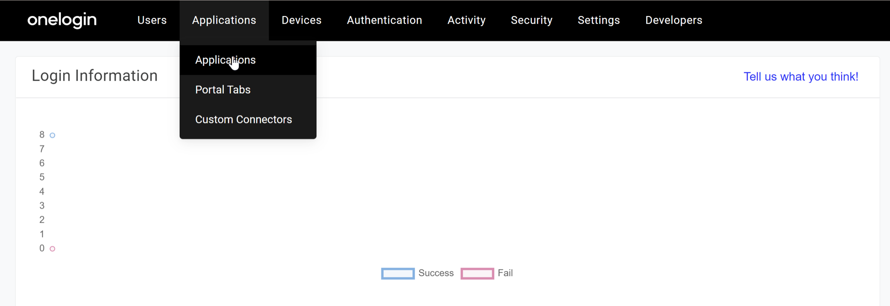
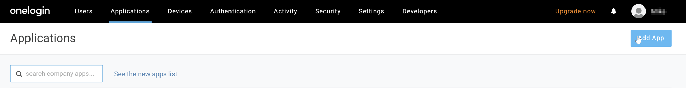
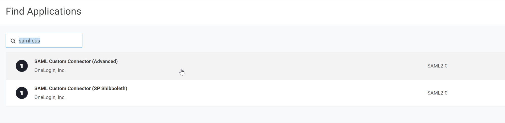
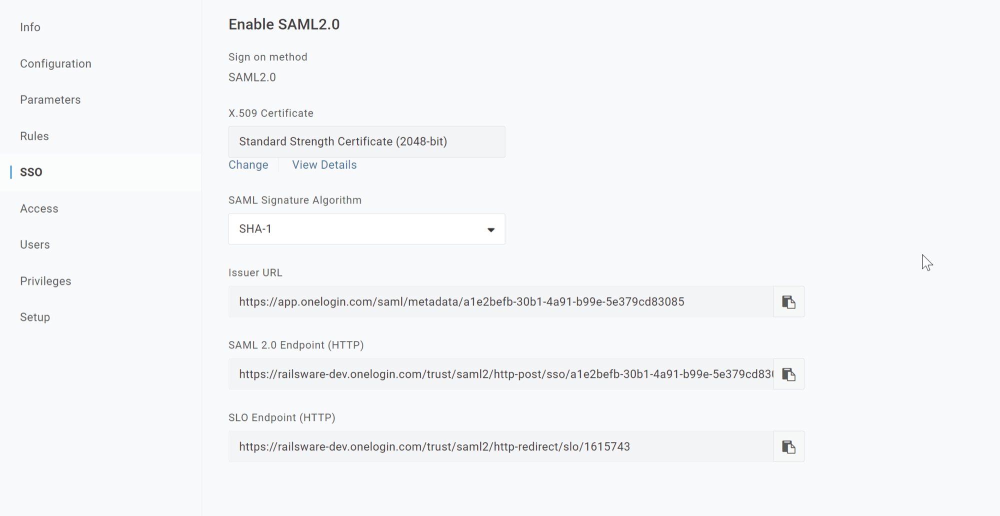

# Setup SSO with OneLogin

## Overview

This guide walks you through setting up Single Sign-On (SSO) between Mailtrap and OneLogin using a SAML custom connector.

## On OneLogin Side



**Navigate to Applications**

Access the Applications section in your OneLogin admin console.




**Search for SAML Custom Connector**

Look for "SAML custom connector" in the applications catalog.




**Open SAML Custom Connector Configuration**

Open the SAML custom connector configuration screen.




**Enter SSO Data from Mailtrap**

Configure the SAML connector with the SSO details provided by Mailtrap.



