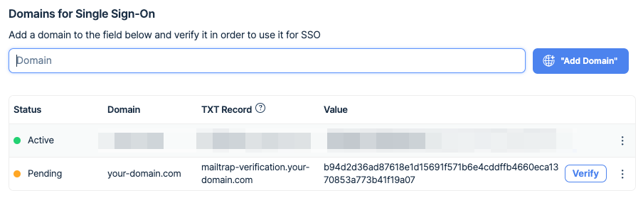
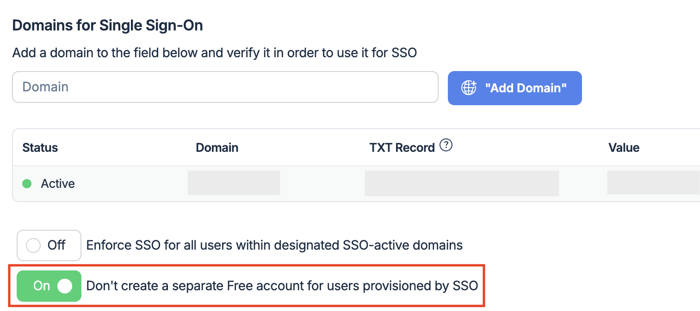
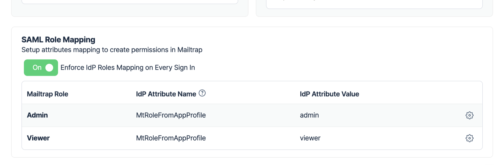

# Overview

You can use any Identity Provider that supports the [SAML 2.0](https://en.wikipedia.org/wiki/SAML_2.0) protocol in order to authenticate users via single sign-on (SSO) on Mailtrap.

Mailtrap automatically creates users using just-in-time provisioning when a user logs in with Mailtrap SSO.


SSO is available only for users on Enterprise plans.


# How to enable SAML SSO in Mailtrap


Only the Account Owner has access to enable/disable SAML on an account.


To enable the SAML configuration for the Mailtrap account - go to **Settings** > **Account settings** > **SSO** or [open the SSO tab](https://mailtrap.io/account-management?current_tab=sso) and add/edit the SAML configuration.

## Step 1: Add and verify the domain

1. Enter your domain in the Domain field and click the **Add Domain** button.
2. In the displayed table, you will find the record and its value generated by Mailtrap.
3. Go to your domain settings page, select Manage DNS, and choose TXT from the list of options (for details, consult your domain provider documentation).
4. Copy the authentication key generated by Mailtrap from the _Value_ column and paste it to your TXT record.
5. Once completed, get back to Mailtrap and click the **Verify** button for this domain. The status should change to _Active_.

## Step 2: Configure SSO

1. Choose whether you want to enforce SSO sign-in for users provisioned by SSO. When enabled, users whose sign-in is provisioned by SSO won't be able to sign in using any method except SSO.

2. Choose whether you want to create a separate free account for users provisioned by SSO. When enabled, new users won't get a separate account. When disabled, each new user will also get a separate account in addition to the one they get via SSO. Applies to newly provisioned users only.

## Step 3: Mailtrap → Identity Provider

**You'll need to provide the following to Mailtrap from your Identity Provider:**

- IdP Entity ID (Identity Provider Issuer)
- Single Sign-on URL
- Optional: Single Logout Service (SLO) URL
- X509 Certificate

## Step 4: Identity Provider → Mailtrap

**You'll need to provide the following SAML Provider details to your Identity Provider from Mailtrap:**

- Entity ID
- Assertion Consumer Service URL
- Single Logout Service URL

## Step 5: Role mapping

By default, users created in Mailtrap via SSO have roles with empty permission, so users cannot View or Edit any projects or sandboxes. In this case, you can assign permissions manually within Mailtrap User Management.

To map your IdP roles to roles in Mailtrap, you need to create a mapping in the **SAML Role Mapping** section in Mailtrap.

In the example above, a user with the IdP attribute "MtRoleFromAppProfile" and the name "admin" (which should be configured as Attributes in the IdP) should be assigned the "Admin" role in Mailtrap.

You have the option to enforce IdP role mapping on every sign-in. That way, Mailtrap will fetch a new role from the IdP provider to check for any changes on its side. IdP provider **should sign out** of Mailtrap so that we can fetch the updated role attribute.
